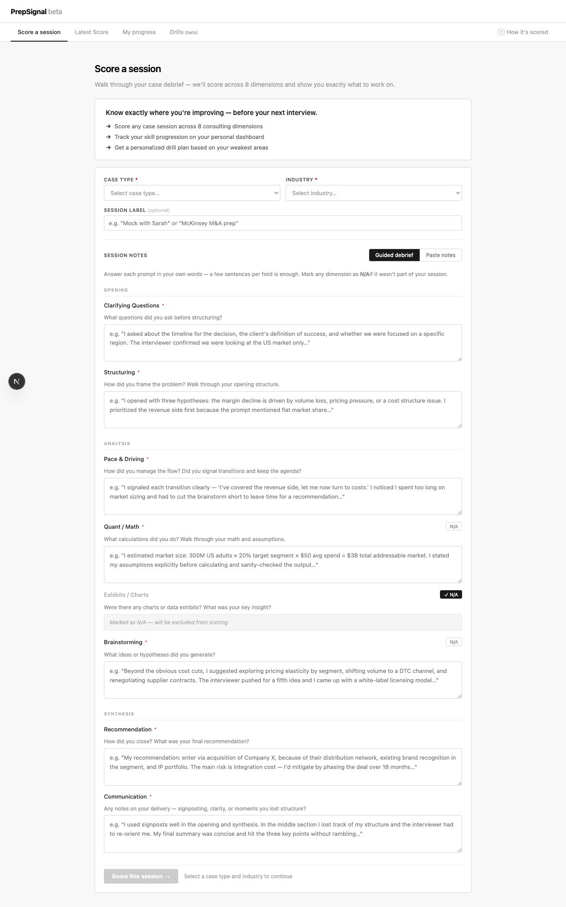
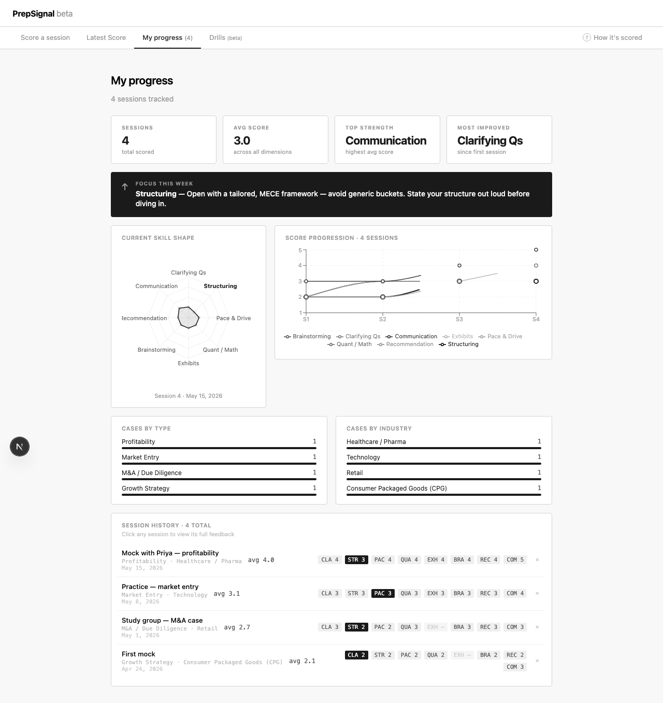

# PrepSignal

AI-powered case interview scoring for MBB candidates. Score any practice session across 8 consulting dimensions, track your improvement over time, and get a personalized drill plan.

**[Live Demo → prepsignal.vercel.app](https://prepsignal.vercel.app)**

---



---

## The problem

MBA candidates preparing for McKinsey, BCG, and Bain interviews have no reliable way to know if they're actually improving. Peer feedback is inconsistent. Existing platforms provide drills but no cross-session measurement. You finish a mock and don't know whether you're better than last week.

## What PrepSignal does

After each mock case, you walk through a guided debrief (or paste free-form notes). PrepSignal uses Claude to score you across 8 dimensions with verbatim quotes from your own notes as evidence:

| Dimension | What it measures |
|-----------|-----------------|
| Clarifying Questions | Did you ask targeted questions before structuring? |
| Structuring | Was your framework MECE and tailored to the case type? |
| Pace & Drive | Did you own the agenda and manage your time? |
| Quant / Math | Accurate calculations with stated assumptions? |
| Exhibits | Did you lead with the insight, not describe the chart? |
| Brainstorming | Creative, non-obvious ideas beyond the obvious list? |
| Recommendation | Clear, committed, data-backed close? |
| Communication | Signposted, concise delivery throughout? |

Your dashboard tracks all sessions over time. The **Drills** tab generates a personalized practice plan based on your weakest areas across your full history.

---



---

## Tech stack

- **Framework** — Next.js 16 (App Router)
- **AI** — Anthropic Claude (`claude-sonnet-4-6`)
- **Charts** — Recharts (radar + line progression)
- **Storage** — `localStorage` — no backend, no auth required
- **Deployment** — Vercel

## Running locally

```bash
# 1. Clone and install
git clone https://github.com/ryanjsheehan1/prepsignal.git
cd prepsignal
npm install        # or: bun install

# 2. Add your Anthropic API key
cp .env.local.example .env.local
# Edit .env.local — set ANTHROPIC_API_KEY=sk-ant-...

# 3. Start the dev server
npm run dev        # → http://localhost:3002
```

## Environment variables

| Variable | Required | Description |
|----------|----------|-------------|
| `ANTHROPIC_API_KEY` | Yes | Get yours at [console.anthropic.com](https://console.anthropic.com) |

## How it works

1. **Input** — Guided debrief form (one field per dimension) or free-form paste. Case type and industry are tagged for breakdown charts.
2. **Scoring** — Session content is sent to Claude with a structured rubric prompt. The model returns JSON: score (1–5), a verbatim quote from your notes, and a one-sentence rationale per dimension.
3. **Priority** — The lowest rolling average across your last 3 sessions determines the single focus area shown on the dashboard. No list of 6 things — one priority.
4. **Drills** — A second Claude call analyzes all your sessions and generates a personalized drill plan: top-priority exercises, a 1–2 week schedule, case type coverage gaps, and trend analysis.

## Project background

Built as an MBA class project at Penn (Wharton). The core thesis: case prep tools give you content but not signal. PrepSignal owns the session log and uses AI scoring to give candidates the measurement layer that's been missing.

---

Built by Ryan Sheehan — [github.com/ryanjsheehan1](https://github.com/ryanjsheehan1)
